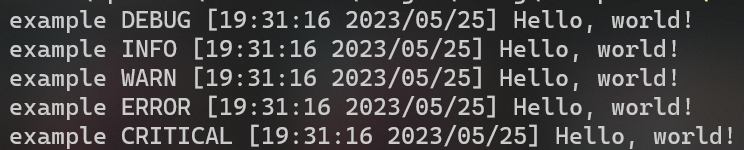

# vollerei
✨ Blazing fast Logging in Rust

# Table of Contents
1. [Metadata](#metadata)
2. [Install](#install)
3. [Examples](#examples)

# Metadata
Size: `~5.73` kB

# Install
### Run the following Cargo command in your project directory
`cargo add vollerei`
### Or add the following line to your Cargo.toml
`vollerei = "0.1.2"`

# Examples
`examples/basic.rs`
```
use vollerei::logger::Logger;

fn main() {
    let logger = Logger::new("example");

    logger.debug("Hello, world!");
    logger.info("Hello, world!");
    logger.warn("Hello, world!");
    logger.error("Hello, world!");
    logger.critical("Hello, world!");
}
```
`assets/basic.png`
